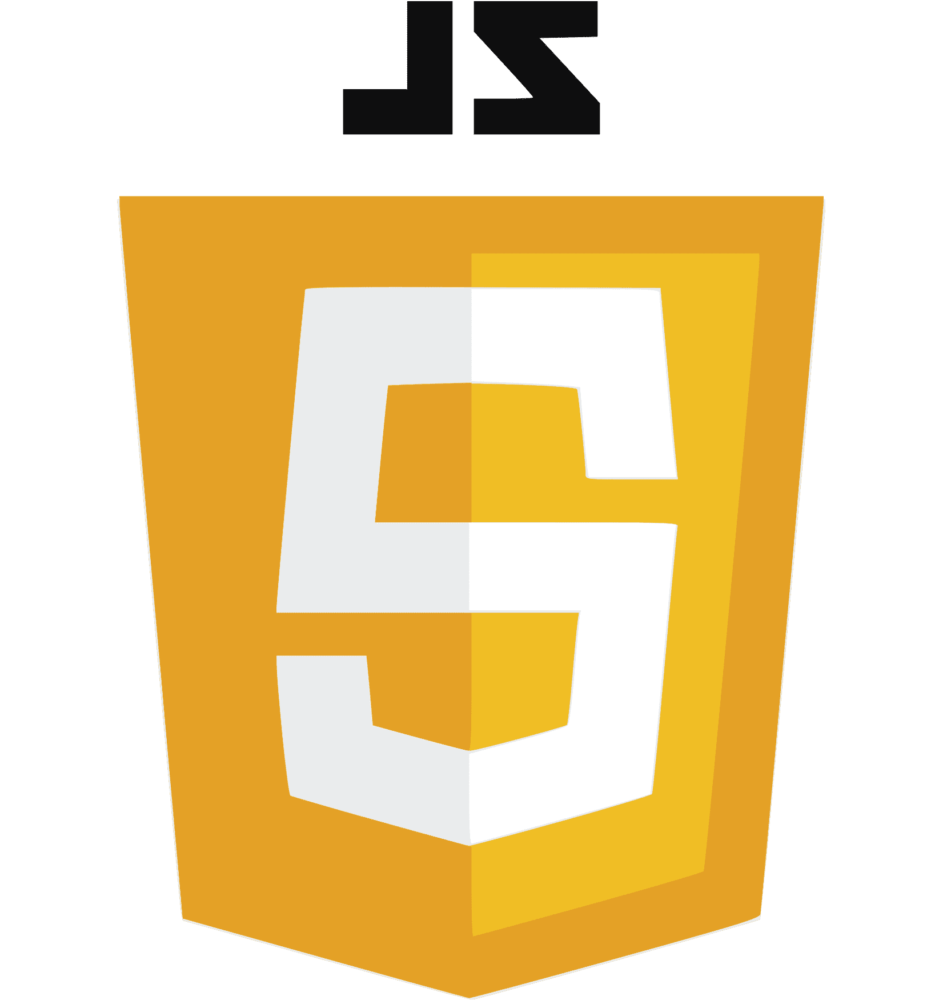
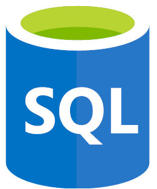

###                         Hola!👋 Soy Santiago :argentina:✨ <h1></h1>

<!-- **HollSann/HollSann** is a ✨ _special_ ✨ repository because its `README.md` (this file) appears on your GitHub profile. -->

<h1>Sobre mí</h1>

Soy apasionado, autodidacta y autocrítico. Cada día intento mejorar mis habilidades blandas y técnicas. En 2021 comencé a interesarme por el mundo IT, hasta
que en 2022 ese interés se transformó en una pasión y
decidí comenzar la carrera Analista en Sistemas (UNLP). Siempre intento superarme y adquirir todo el conocimiento en las distintas tecnologías como me sea posible.

# Tecnologías que he aprendido y sigo estudiando 📚🌱

## Frontend:

#### HTML || CSS || JavaScript || React || Bootstrap

    
    
    
    
    

## Backend:
#### Express.js || Next.js || Node.js || Python || SQL || MongoDB
   

     
     
     
     
     
     
 

## Controladores de versiones:
#### Git || Github

<!-- 

 
 -->

<!--  Here are some ideas to get you started:

- 🔭 I’m currently working on ...
- 🌱 I’m currently learning ...
- 👯 I’m looking to collaborate on ...
- 🤔 I’m looking for help with ...
- 💬 Ask me about ...
- 📫 How to reach me: ...
- 😄 Pronouns: ...
- ⚡ Fun fact: ... -->
<!-- 

 -->

